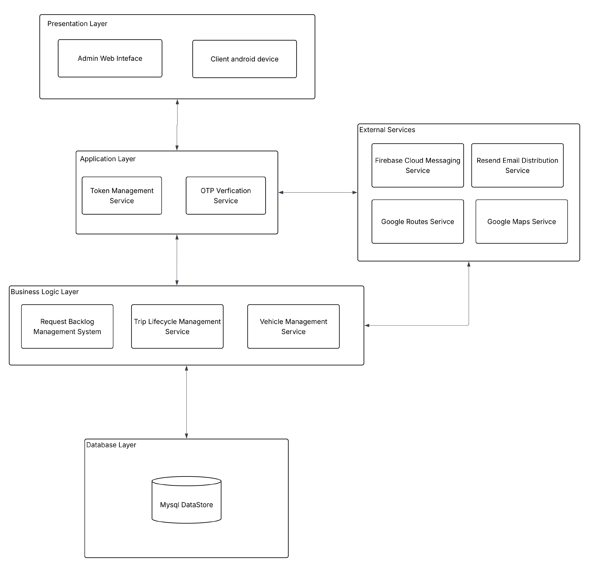
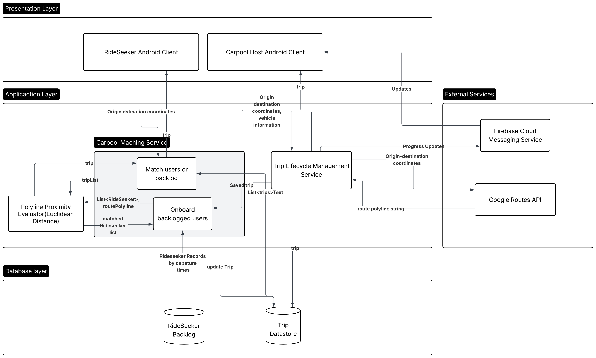

# Swoopr Server

[]()
[]()
[]()
[]()<br>
Swoopd Server is an asynchronous backend engine built with **Spring Boot 4** and **Java 25**, specifically engineered for university and campus-centric carpooling platforms (tailored for USIU and surrounding metropolitan zones).
---

## Key Features

- **Intelligent Carpool Matching Engine:** Automatically pairs ride seekers with compatible open carpools using departure time windows ($\pm15\text{ mins}$), campus inbound/outbound directional validation, and route polyline proximity.
- **Polyline Proximity & Euclidean Distance Calculation:** Uses decoded Google Maps route polylines and computes shortest Euclidean distance vectors between rider coordinates and driver trajectories.
- **Dynamic Rider Backlog Pipeline:** Automatically backlogs unmatched ride requests and instantly onboards waitlisted riders when new matching carpools are created.
- **Geofencing & Campus Validation:** Enforces campus boundaries (USIU campus geofence) on all trip origins and destinations.
- **Event-Driven & Non-Blocking Workflow:** Utilizes Spring `@Async` task executors with Firebase Cloud Messaging (HTTP v1 API) for push updates and real-time lifecycle event notifications.
- **Secure Authentication & Token Management:** In-memory / Redis-backed token and OTP verification, SHA-256 password hashing with salting, and role-based access control (Super Admin, Host, Rider).
- **In-App Messaging & Admin Telemetry:** Real-time carpool chat logging and administrative broadcast / notification controls.

---

## System Architecture

### 1. High-Level Software Architecture (`swArchitecture`)

The Swoopd backend adheres to a modular, layered architecture with asynchronous task delegation, decoupled external integration proxies, and multi-tier data persistence.

> **High Level Architecture Diagram:**
> 
> 

---

### 2. Business Logic Architecture (`businessArchitecturalDiagram`)

The diagram below details the end-to-end lifecycle of trip creation, rider carpool matching, asynchronous backlog buffering, and shortest Euclidean distance route evaluation.

> Core Business Logic Diagram:
> 
> 

---

## Core Algorithms & Business Logic Breakdown

### 1. Geofencing & Campus Boundary Evaluation
All carpooling activities are tethered to the USIU-Africa campus perimeter. The `UsiuCampusGeofenceService` checks that either the trip origin or destination coordinates fall within designated geofence bounds:
Requests that neither originate from nor terminate at the campus boundary are rejected immediately.

### 2. Polyline Proximity & Euclidean Distance Calculation
When a carpool route is generated, the Google Routes API returns an encoded polyline string representing the vehicle's expected driving trajectory. 

The `PolylineProximityEvaluator`:
1. **Decodes Polyline:** Converts the encoded string into a list of discrete latitude/longitude coordinate points:
   $$\mathcal{P} = \{(\text{lat}_1, \text{lng}_1), (\text{lat}_2, \text{lng}_2), \dots, (\text{lat}_n, \text{lng}_n)\}$$
2. **Computes Euclidean Distance:** For a rider's origin coordinate $(x_0, y_0)$, calculates the minimum Euclidean distance across all points in the polyline trajectory:
   $$d_{\min} = \min_{i=1\dots n} \sqrt{(x_0 - \text{lat}_i)^2 + (y_0 - \text{lng}_i)^2}$$
3. **Threshold Filtering & Ranking:** 
   - A proximity threshold of `PROXIMITY_THRESHOLD = 10.0` (scaled geospatial tolerance) is applied.
   - For rider matching: Selects the open trip yielding the minimal distance $\le 10.0$.
   - For backlog onboarding: Ranks all unmatched requests by minimum distance ascending and sequentially assigns seats until trip capacity is reached (`TripStatus.FULL`).

### 3. Asynchronous Backlog Lifecycle & Onboarding
- If a rider request cannot be immediately paired with an active trip, a `RideSeekerBacklogEntry` record is created.
- When any driver initiates a new trip via `createTrip()`, the system immediately triggers `onBoardBackloggedUsers(Trip trip)`:
  1. Queries all active unmatched backlog requests.
  2. Filters entries within a 30-minute window ($\pm15\text{ minutes}$ of the driver's departure time).
  3. Evaluates Euclidean proximity along the route polyline.
  4. Automatically fills empty seats and dispatches push notifications to riders.

---

## Tech Stack & Components

| Category | Technologies / Libraries                                                                                                     |
| :--- |:-----------------------------------------------------------------------------------------------------------------------------|
| **Framework & Runtime** | Java 25, Spring Boot 4.0.6, Spring Data JPA, Spring Web                                                                      |
| **Async Processing** | Spring `@Async`, `ThreadPoolTaskExecutor`                                                                                    |
| **Database & Cache** | MySQL 8+ (Connector/J), Hibernate Dialect, Embedded Redis                                                                    |
| **Cloud & APIs** | Google Maps Services (`google-maps-services:2.2.0`), Google Routes API, Firebase Admin / Cloud Messaging HTTP v1, Resend API |
| **Security & Auth** | Custom Token Authentication, SHA-256 Password Hashing with Salt, Super Admin Initialization                                  |
| **Utilities** | Project Lombok, Jackson JSR310 Datatype                                                                                      |
| **Containerization** | Docker, Cloud Build (`cloudbuild.yaml`)                                                                                      |

---

## REST API Overview

Base path: `/trip-management`

| Method | Endpoint | Description |
| :--- | :--- | :--- |
| `POST` | `/postTrip` | Initiates host trip creation with vehicle validation & route generation |
| `POST` | `/postRideRequest` | Matches rider with open trip or buffers into backlog |
| `POST` | `/postVehicle` | Registers a vehicle for a carpool host |
| `POST` | `/removeVehicle` | Deregisters a host vehicle |
| `POST` | `/cancelCarpool` | Cancels an active trip and alerts all passengers |
| `POST` | `/cancelRideRequest` | Cancels a pending rider backlog entry |
| `POST` | `/leaveCarpool` | Allows a passenger to vacate their seat in an open trip |
| `GET` | `/getTripInfo` | Retrieves detailed information for an active trip |
| `GET` | `/getRideRequestInfoById`| Retrieves details for a specific backlog entry |
| `GET` | `/getActiveRideRequests` | Fetches active backlog requests for the authenticated user |
| `GET` | `/getRegisteredVehicles` | Lists all vehicles registered under the user profile |

---

## Getting Started

### Prerequisites
- **JDK 25** installed.
- **Maven 3.9+** (or use the included `./mvnw` wrapper).
- **MySQL 8.0+** running locally or in a container.
- **Redis** server running (optional; embedded Redis is configured for test/local profiles).
- **Google Cloud Platform Project** with Directions/Routes API and Geocoding API enabled.
- **Firebase Project** service account credentials for FCM push notifications.

### Environment Configuration
Create an `.env` or `.env.properties` file in the project root:

```properties
# Database Credentials
DB_URL=jdbc:mysql://localhost:3306/swoopd_db?useSSL=false&serverTimezone=UTC&allowPublicKeyRetrieval=true
DB_USERNAME=swoopr_user
DB_PASSWORD=swoopr_password

# Google Cloud & Maps
GCP_PROJECT_ID=your-gcp-project-id
GOOGLE_MAPS_API_KEY=your-google-maps-api-key

# Resend Email Service
RESEND_API_KEY=your-resend-api-key

# Initial Super Admin Configuration
SUPER_ADMIN_EMAIL=admin@swoopd.org
SUPER_ADMIN_PASSWORD=YourSecureAdminPassword123!
SUPER_ADMIN_NAME=SystemAdministrator

# Backlog Maintenance
trip.backlog.cleanup.delay-ms=60000
```

### Build and Run

#### Using Maven Wrapper
```powershell
# Compile and build the project
./mvnw clean package -DskipTests

# Run the Spring Boot application
./mvnw spring-boot:run
```

#### Using Docker
```powershell
# Build Docker image
docker build -t swoopd-server:latest .

# Run Docker container
docker run -p 8080:8080 --env-file .env swoopd-server:latest
```

---

## Directory Structure

```text
swoopdServer/
├── src/main/java/org/hamisi/swoopdserver/
│   ├── admin/                    # Admin controller, DTOs, and system management services
│   ├── auth/                     # Authentication, registration, OTP, and user credentials
│   ├── common/                   # Token management, global exception handling, access records
│   ├── config/                   # Async thread pool, Redis, Super Admin boot initializers
│   ├── in_app_messeging/         # Carpool chat and live trip communications
│   ├── notificationUtilities/    # Firebase FCM HTTP v1 proxy and OAuth2 token management
│   ├── tripManagement/           # Core carpool domain:
│   │   ├── controllers/          # Trip REST endpoints & exception handlers
│   │   ├── dtos/                 # TripCreationDTO, JoinCarpoolDto, VehicleDto, etc.
│   │   ├── entities/             # Trip, TripMembership, RideSeekerBacklogEntry, Vehicle
│   │   ├── geofence/             # UsiuCampusGeofenceService campus boundaries
│   │   ├── proxies/              # GoogleRoutesProxy / Maps Geocoding & Routes integration
│   │   ├── repositories/         # TripRepository, RideSeekerBacklogRepository, VehicleRepository
│   │   └── services/             # CarpoolMatching, Lifecycle, PolylineProximityEvaluator, Backlog
│   └── users/                    # User entity model
├── src/main/resources/           # Configuration files and admin static assets
├── swArchitecture.png            # Software architecture diagram
├── businessArchitecturalDiagram.png # Core business logic architecture diagram
├── pom.xml                       # Maven build configuration (Java 25, Spring Boot 4)
└── Dockerfile                    # Multi-stage production container build definition
```

---

## License & Contact
Developed as part of the **Swoopr** carpooling platform for university mobility. For questions, issues, or contributions, email me at **soipanhani@gmail.com**.
