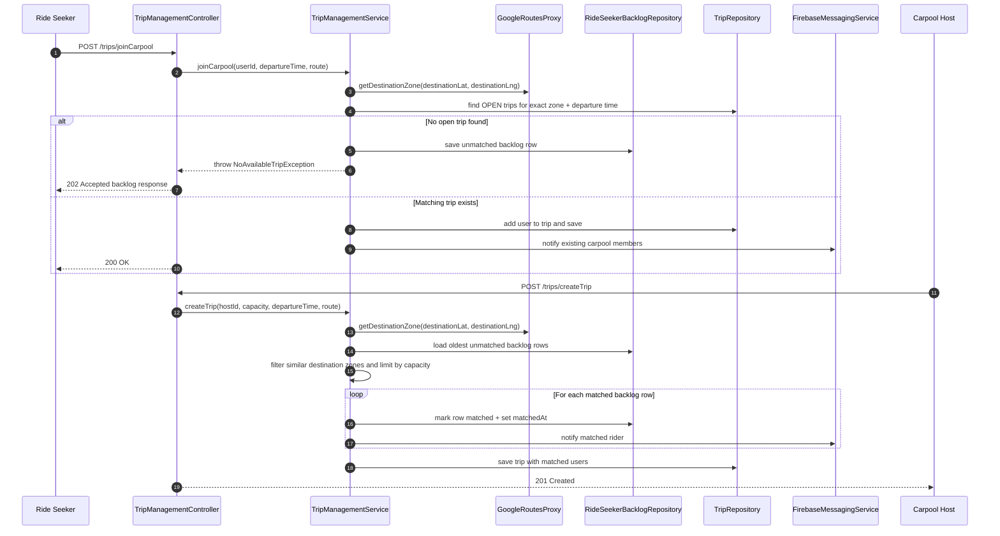

# Trip Management Backlog Persistence Sequence

```mermaid
sequenceDiagram
    autonumber
    participant RideSeeker as Ride Seeker
    participant Controller as TripManagementController
    participant Service as TripManagementService
    participant Maps as GoogleRoutesProxy
    participant Backlog as RideSeekerBacklogRepository
    participant Trips as TripRepository
    participant Notify as FirebaseMessagingService

    RideSeeker->>Controller: POST /trips/joinCarpool
    Controller->>Service: joinCarpool(userId, departureTime, route)
    Service->>Maps: getDestinationZone(destinationLat, destinationLng)
    Service->>Trips: find OPEN trips for exact zone + departure time
    alt No open trip found
        Service->>Backlog: save unmatched backlog row
        Service-->>Controller: throw NoAvailableTripException
        Controller-->>RideSeeker: 202 Accepted backlog response
    else Matching trip exists
        Service->>Trips: add user to trip and save
        Service->>Notify: notify existing carpool members
        Controller-->>RideSeeker: 200 OK
    end

    participant Host as Carpool Host
    Host->>Controller: POST /trips/createTrip
    Controller->>Service: createTrip(hostId, capacity, departureTime, route)
    Service->>Maps: getDestinationZone(destinationLat, destinationLng)
    Service->>Backlog: load oldest unmatched backlog rows
    Service->>Service: filter similar destination zones and limit by capacity
    loop For each matched backlog row
        Service->>Backlog: mark row matched + set matchedAt
        Service->>Notify: notify matched rider
    end
    Service->>Trips: save trip with matched users
    Controller-->>Host: 201 Created
```

